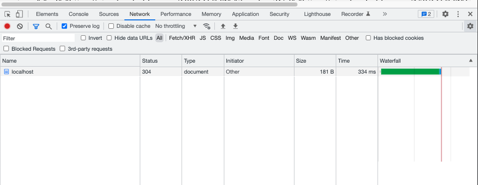
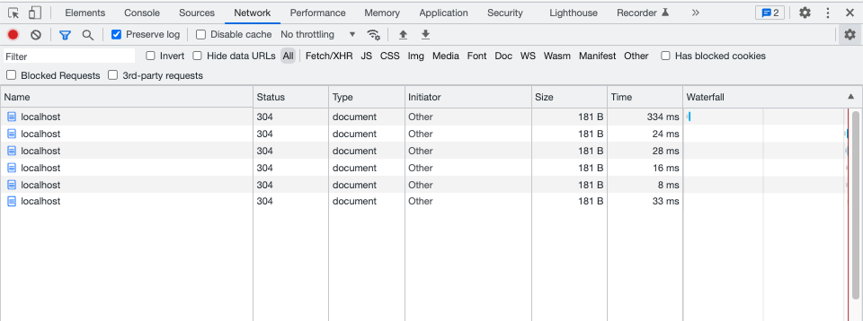

# Redis + node mvp
A introduction to redis as a caching mechanism using node

## Getting started
1. Start server
```bash
# Install dependencies
npm i

# Run server
node index.js
```

2. Curl localhost:3000 for the first time. You'll notice the duration is relatively long.  


3. However, all subsequent calls are much faster.  


4. To clear cache and repeat experience again, curl localhost:3000/flush